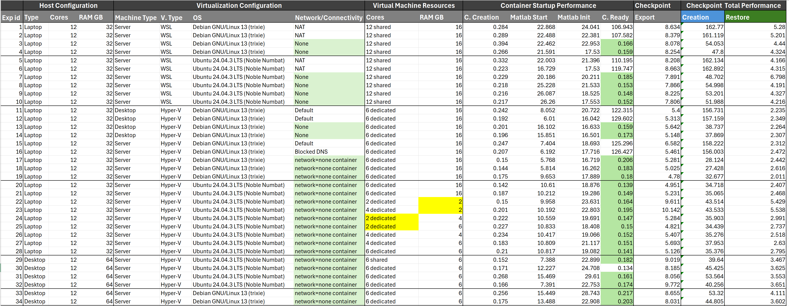

# MATLAB Checkpointing Using Podman
This document describes how to prepare your environment and explore checkpointing using Podman containers and MATLAB.

## 1. Installing Podman
Install Podman and its prerequisites using `Podman/1_Installing_podman_debian_13.sh`.
- **Installing CRIU:** CRIU is required to enable checkpoint/restore functionality on Linux.
- **Installing crun:** The crun version that ships with some distributions may not include CRIU support. Build and install crun configured with CRIU support (use `--with-criu` when running `./configure`).
- Install the Podman package.
- Configure Podman to use the CRIU-enabled `crun` as the default runtime for reliable checkpoint/restore.

## 2. Building MATLAB image
Build a standard MATLAB image and add helper files using `Podman/2_Building_MATLAB_non-interactive_24b.sh`.
- Build the standard MATLAB image using `dockerfiles/non-interactive.Dockerfile`.
- Add checkpointing helper files using `dockerfiles/matlab-ci-ready.Dockerfile`.

## 3. Creating MATLAB checkpoint
Warming up and checkpointing a standard MATLAB container. See `Podman/3_Testing_checkpoint.sh`.
1. Starting a standard MATLAB container
    ```bash
    export IMAGE_FULLNAME="CI_IMAGE_NAME:CI_IMAGE_TAG"
    export MLM_LICENSE_TOKEN="********"
    export cp_container_name="CONTAINER_NAME"
    sudo podman run -d --name $cp_container_name \
        -e MLM_LICENSE_TOKEN=$MLM_LICENSE_TOKEN \
        -v <host_path>:<container_path> \
        $IMAGE_FULLNAME matlab-batch "matlabSessionLoop();"
    ```
    > matlabSessionLoop.m helper script is used to start an inter-process communication (IPC) loop"
1. Waiting for the MATLAB container to finish warming up
    ```bash
    sudo podman exec $cp_container_name matlab-bs-wait-ready
    ```
    > matlab-bs-wait-ready.m helper script is used to wait for all tcp connections within the container to complete.
1. Creating a MATLAB checkpoint
    ```bash
    time sudo podman container checkpoint --compress=none --export=checkpoint_dump.tar
    ```
    > Store the exported checkpoint tar file (`checkpoint_dump.tar`) on fast local storage (avoid slow or network-mounted paths) for best performance.

## 4. Restoring MATLAB checkpoint
Restoring a MATLAB checkpoint and executing commands. See `Podman/3_Testing_checkpoint.sh`.
1. Restore the MATLAB container
    ```bash
    export cp_container_test="container_test_export"
    time sudo podman container restore --import=checkpoint_dump.tar --name $cp_container_test
    ```
1. Run commands inside the restored container
    ```bash
    sudo podman exec $cp_container_test matlab-bs -batch "new_system('b')"
    sudo podman exec $cp_container_test matlab-bs -batch "sqrt(36)"
    ```
    > The `matlab-bs` helper script facilitates IPC between a `podman exec` process and the warmed MATLAB session inside the container.

---

# Experiment Results Table

